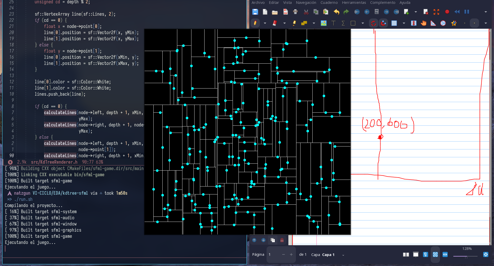

# Point Quadtree

Based in the invention of Jon Bentley in 1970s, this project is a implementation in C++ with SFML separating logic into two classes (Kdtree and SFML renderer).
The finally of this project is learn of KdTree and SFML library.

## REFERENCES
[CMU Kdtree](https://www.cs.cmu.edu/~ckingsf/bioinfo-lectures/kdtrees.pdf)
[Geeks for Geels Kdtree insertion and search](https://www.geeksforgeeks.org/search-and-insertion-in-k-dimensional-tree/)
